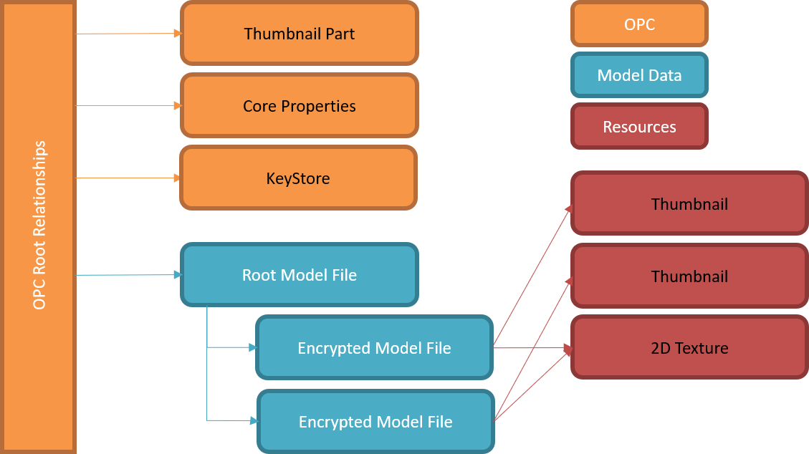
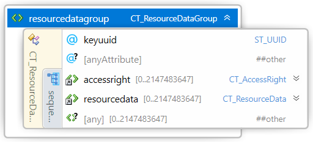
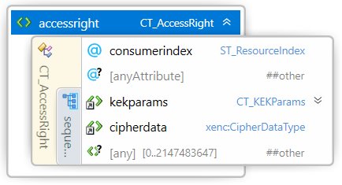

#
# 3MF Secure Content Extension

## Specification & Reference Guide


| **Version** | 1.0.3 |
| --- | --- |
| **Status** | Published |

## Table of Contents

- [Preface](#preface)
  * [About this Specification](#about-this-specification)
  * [Document Conventions](#document-conventions)
  * [Language Notes](#language-notes)
  * [Software Conformance](#software-conformance)
- [Part I: 3MF Documents](#part-i-3mf-documents)
  * [Chapter 1. Introduction](#chapter-1-introduction)
    + [1.1 Encryption scheme](#11-encryption-scheme)
    + [1.2 Parts Relationships](#12-parts-relationships)
    + [1.3 Package Organization and OPC Compliance](#13-package-organization-and-opc-compliance)
  * [Chapter 2. Key Store](#chapter-2-key-store)
      - [2.1 Consumer](#21-consumer)
      - [2.2 Resource Data Group](#22-resource-data-group)
  * [Chapter 3. OPC Relation and Content Types](#chapter-3-opc-relation-and-content-types)
    + [3.1 Content Types](#31-content-types)
    + [3.2 Relation Files](#32-relation-files)
    + [3.3 Encrypted File Relationship](#33-encrypted-file-relationship)
- [Part II. Appendixes](#part-ii-appendixes)
  * [Appendix A. Glossary](#appendix-a-glossary)
  * [Appendix B. 3MF XSD Schema](#appendix-b-3mf-xsd-schema)
  * [Appendix C. Standard Content Types and Relationships](#appendix-c-standard-content-types-and-relationships)
    + [C.1 Content Types](#c1-content-types)
    + [C.2 Relationships](#c2-relationships)
  * [Appendix D. 3MF Cipher File Format](#appendix-d-3mf-cipher-file-format)
- [References](#references)

# Preface

## About this Specification

This 3MF Secure Content Extension is an extension to the core 3MF specification. This document cannot stand alone and only applies as an addendum to the core 3MF specification. Usage of this and any other 3MF extensions follow an a la carte model, defined in the core 3MF specification.

Part I, “3MF Documents,” presents the details of the primarily XML-based 3MF Document format. This section describes the XML markup that defines the composition of 3D documents and the appearance of each model within the document.

Part II, “Appendixes,” contains additional technical details and schemas too extensive to include in the main body of the text as well as convenient reference information.

The information contained in this specification is subject to change. Every effort has been made to ensure its accuracy at the time of publication.

This extension MUST be used only with Core specification 1.x.

## Document Conventions

See [the 3MF Core Specification conventions](https://github.com/3MFConsortium/spec_core/blob/master/3MF%20Core%20Specification.md#document-conventions).

## Language Notes

See [the 3MF Core Specification language notes](https://github.com/3MFConsortium/spec_core/blob/master/3MF%20Core%20Specification.md#language-notes).

## Software Conformance

See [the 3MF Core Specification software conformance](https://github.com/3MFConsortium/spec_core/blob/master/3MF%20Core%20Specification.md#software-conformance).

# Part I: 3MF Documents

# Chapter 1. Introduction

This document describes a new Open Packaging Conventions (OPC) root part for securely encrypting resources within a 3MF package. If not explicitly stated otherwise, each of these resources is OPTIONAL for producers, but MUST be supported by consumers that specify support for the 3MF Secure Content Extension.

This extension describes the encryption mechanism to protect the 3MF content files (OPC parts), and it should be used in coordination with other 3MF extensions that refer to content stored in different OPC parts: models, textures, etc.

In order to allow for the use of 3MF in secure printing environments, several additions are needed to efficiently support confidentiality of specific content in the 3MF package, providing a 3MF producer with the capability to control which consumers have access to the confidential content.

The underlying mechanism is focusing on a granular and efficient sensitive content encryption. The essential key management issues that come with real world applications are left to larger ecosystems. Some use cases include:
- Ensuring end-to-end encryption from producer to device for privacy sensitive information (like medical patient data)
- Obeying Governmental regulations for production data (like ITAR or GDPR)
- Digital Asset Security applications in Industry 4.0 environments
- Secure Archiving of Print Data in untrusted environments (like Cloud Storage) without the risk of content leakage.

A consumer not supporting the 3MF Secure Content Extension MAY be able to consume the 3MF with this extension, but it may miss any encrypted OPC part.

To avoid data loss while parsing, a 3MF package which uses referenced objects SHOULD enlist the Secure Content Extension as “required extension”, as defined in the core specification. However, if the Secure Content Extension is not enlisted as required, any consumer which does not support the Secure Content Extension will be able to access the unencrypted OPC parts.

A producer MAY add a MustPreserve relationship to the Key Store OPC part or any encrypted OPC part to indicate to consumers that do not support the 3MF Secure Content extension that SHOULD save those OPC parts when modifying the 3MF file.

## 1.1 Encryption scheme

The encryption model used is a 'two-level' Key Encryption Key - Content Encryption Key (KEK-CEK) wrapping scheme:

- Each confidential resource is encrypted using an efficient symmetric Content Encryption Method, with a randomly generated symmetric Content Encryption Key (CEK). There may be several resources in a 3MF package that requires confidentiality, so a CEK MUST be provided for each one of them. Consumers MUST support, at a minimum, the AES256 GCM (Gaulois Counter Mode).

- The CEK for each one of the confidential resources may be wrapped with one or several Key Encryption Keys (KEK), using wrapping methods that ensure that only the intended consumers can decrypt and use the CEK. This means that the consumers must have available the decryption key.

- When the wrapping method is an RSA2048 asymmetric private decryption key, and the corresponding public key must be made available to the producer to encrypt the CEK. Consumer MUST support, at a minimum, the asymmetric RSA2048 OAEP Key Encryption Method, based on public and private keys scheme.

-	There could be several consumers for the same 3MF file and at the same time some consumers might have more than a pair of public and private keys, e.g. for different job types. To provide simultaneous access to all authorized parties, the CEK for a confidential resource may be encrypted several times, one for each different potential consumer.

 - A trusted public key exchange is outside of this specification and needs to be handled by the specific ecosystem.
 
- Alternative wrapping schemes might also be supported by a consumer, for example using a symmetric KEK which might be delived to the consumer(s) by any extenal mechanism to the 3MF file.

The KEK-CEK wrapping scheme provides efficiency because the (probably large) data in a confidential resource is encrypted/decrypted only once using an efficient symmetric encryption algorithm and KEK approach provides flexibility in controlling who can access the confidential data, by allowing encrypting the CEK with different KEKs.

The mechanism for storing the CEK in the 3MF is optional. It provides a mean to communicate the CEK for each part. However, the CEKs might be transferred to the consumer by any other means, externally to the 3MF file.

## 1.2 Parts Relationships

The primary emphasis of this extension is the possibility to protect OPC parts separated from the root model file. This structural approach enables two primary advantages for producers and consumers of 3MF packages with large numbers of individual models:

- The build directive in the root model file can be parsed by consumers without having to parse any encrypted file.
- Key Store in a separate file to be able to link to any content file, except the root model parts.

In order to identify that a file is encrypted, without having to search through the Key Store, a new "Encrypted" relationship is defined in [3.3 Encrypted File Relationship](#33-encrypted-file-relationship).

When used in conjunction with the 3MF Production extension version 1.2 or above, the root model part MAY have relationships to other model parts whose resources can be referenced by the parent model stream by their file path. When any of those file paths is found in the \<keystore> element, it is identified as an encrypted OPC part.

Other content files defined in other 3MF extensions might be also encrypted, when identified by their file paths in the \<keystore> element. For example, color textures as defined in the 3MF materials and properties extension, etc.

Non-root OPC parts and Custom Parts MAY be encrypted. Root OPC root relationships as defined in to [the 3MF Core Specification Package Organization and OPC Compliance](https://github.com/3MFConsortium/spec_core/blob/master/3MF%20Core%20Specification.md#211-3d-parts-and-payload-relationships) and non-root parts relationships MUST NOT be encrypted to be compliant with OPC.

## 1.3 Package Organization and OPC Compliance

A new 3MF resource, the Key Store, is defined to support content encryption. The \<keystore> element stores the encryption information for the different confidential resources in the package.

For each confidential resource, the Key Store may contain:

- Information on how the content is encrypted, the wrapping method, and other information relevant to enable content decryption.

- One CEK wrapped using a KEK, with the corresponding information about the wrapping method used, for each one of the consumers authorized to decrypt confidential content.

A consumer supporting the 3MF Secure Content Extension MUST support, at a minimum, the RSA2048 OAEP wrapping method. Other wrapping methods, for example using symmetric keys, might also be supported by a consumer.

##### Figure 1–1. A typical 3MF Secure Content Document with multiple encrypted model streams


# Chapter 2. Key Store

Element **\<keystore>**


| Name   | Type   | Use   | Default   | Annotation |
| --- | --- | --- | --- | --- |
| UUID | **ST\_UUID** | required |   | A universally unique ID that allows the Key Store to be identified. |
| @anyAttribute | | | | |

The Key Store part consists of a \<keystore> element that encapsulates encryption key data and references to the encrypted content. 

The \<keystore> element contains a set of \<consumer> elements and \<resourcedata> elements. Each \<consumer> element contains the information to identify a consumer key and each \<resourcedata> references the encrypted content and includes the information to be able to decrypt it, such as the encryption algorithm used and the content encryption key, encrypted with the key encryption key of each consumer.

**UUID** - The Key Store universal unique ID that allows the Key Store to be identified over time and across physical and across applications and printers.

When an editor modifies the Key Store, it MUST produce a new uuid to univocally identify the new \<keystore> element content.

>**Note:** "Unique identifier" MUST be any of the four UUID variants described in IETF RFC 4122, which includes Microsoft GUIDs as well as time-based UUIDs.

## 2.1 Consumer

Element **\<consumer>**


| Name   | Type   | Use   | Default   | Annotation |
| --- | --- | --- | --- | --- |
| consumerid | **string** | required |   | ID of the target consumer. |
| keyid | **string** | |   | Optional key identifier. |
| @anyAttribute | | | | |

The \<consumer> element under a \<keystore> element contains the target consumer specific information. When a \<keystore> element constains more than one consumer it means that there is more than a single recipient that could decrypt the content.

**consumerid** - On asymetric wrapping schemes, the consumer ID attribute to be referenced from the \<accessright> elements from a \<resourcedata> element to specify to which \<consumer> is intended the encrypted content.

A consumer MUST be identified by "consumerid", an attribute in \<consumer> element, where consumerid is a human readable unique identifier (Alphanumeric). Each consumer is expected to have a unique id, which is known to both producer and consumer.

On symmetric wrapping schemes, the target consumer might not be defined in the 3MF document, but in an extenal mechanism to the 3MF Secure Content Extension.

**keyid** - The optional alphanumeric key identifier attribute for identifying the consumer's Key Encryption Key (KEK), which it is used for wrapping the content encryption keys targeted to this consumer.

It is possible that a consumer has different wrapping keys. In this case, additional information about the specific key pair used as Key Encryption Key is needed. This information MAY be provided by specifying the key identification.

See the following example:

```xml
<consumer consumerid=’HP#MOP44B#SG5693454’ keyid="KEK_xxx">
<consumer consumerid=’HP#MOP44B#SG1632635’ keyid="KEK_yyy">
```

#### 2.1.1 Key Value

Element **\<keyvalue>**

In asymmetric wrapping schemes, additional information about the public key used as Key Encryption Key MAY be provided using a \<keyvalue> element containing the public key in PEM format as in [RFC7468](https://tools.ietf.org/html/rfc7468#section-13).

See the following example:

```xml
<consumer consumerid='HP#MOP44B#SG5693454' keyid="KEK_xxx">
  <keyvalue>-----BEGIN PUBLIC KEY-----
MHYwEAYHKoZIzj0CAQYFK4EEACIDYgAEn1LlwLN/KBYQRVH6HfIMTzfEqJOVztLe
kLchp2hi78cCaMY81FBlYs8J9l7krc+M4aBeCGYFjba+hiXttJWPL7ydlE+5UG4U
Nkn3Eos8EiZByi9DVsyfy9eejh+8AXgp
-----END PUBLIC KEY-----
</keyvalue>
</consumer>
```

## 2.2 Resource Data Group

Element **\<resourcedatagroup>**



| Name   | Type   | Use   | Default   | Annotation |
| --- | --- | --- | --- | --- |
| keyuuid | **ST\_UUID** | required |  | UUID that identifies the CEK. |
| @anyAttribute | | | | |

The \<resourcedatagroup> element under a \<keystore> element contains the resource specific encryption information for a set of encrypted resources which are encrypted using the same Content Encryption Key (CEK).

**keyuuid** - UUID that identifies the Content Encryption Key (CEK). This UUID MAY be used to identify the key in external systems, for example in a Digital Rights Management (DRM) system.

Example of a \<resourcedatagroup> element for a set of encrypted resources that can be accessed by two different consumers:

```xml
<resourcedatagroup keyuuid="cb9b46cd-c5be-4f58-b2e3-69edb44ff5fe">
  <accessright consumerindex="0">
    <kekparams wrappingalgorithm="http://www.w3.org/2001/04/xmlenc#rsa-oaep-mgf1p"/>
    <cipherdata>
      <xenc:CipherValue><!-- base64(RSA2048_OAEP encrypted Content Encryption Key) --></xenc:CipherValue>
    </cipherdata>
  </accessright>
  <accessright consumerindex="1">
    <kekparams wrappingalgorithm="http://www.w3.org/2001/04/xmlenc#rsa-oaep-mgf1p"/>
    <cipherdata>
      <xenc:CipherValue><!-- base64(RSA2048_OAEP encrypted Content Encryption Key) --></xenc:CipherValue>
    </cipherdata>
  </accessright>
  <resourcedata path="path to encrypted file1 in package">
    <cekparams encryptionalgorithm="http://www.w3.org/2009/xmlenc11#aes256-gcm" compression="deflate">
      <iv><!-- base64(Initialization Vector) --></iv>
      <tag><!-- base64(Authentication Tag) --></tag>
      <aad><!-- base64(Additional Authenticated Data) --></aad>
    </cekparams>
  </resourcedata>
  <resourcedata path="path to encrypted file2 in package">
    <cekparams encryptionalgorithm="http://www.w3.org/2009/xmlenc11#aes256-gcm" compression="deflate">
      <iv><!-- base64(Initialization Vector) --></iv>
      <tag><!-- base64(Authentication Tag) --></tag>
      <aad><!-- base64(Additional Authenticated Data) --></aad>
    </cekparams>
  </resourcedata>
</resourcedatagroup>
```

## 2.2.1 Resource Data

Element **\<resourcedata>**


| Name   | Type   | Use   | Default   | Annotation |
| --- | --- | --- | --- | --- |
| path | **ST\_Path** | required |  | Path to the encrypted resource file. |
| @anyAttribute | | | | |

The \<resourcedata> element under a \<resourcedatagroup> element contains the resource specific encryption information for an encrypted resource and the file path to the encrypted content file.

**path** - Path to the encrypted file in the OPC package. The path MUST be treated as a hash map to identify encrypted files referenced from any XML model file by their path attribute defined in 3MF extensions. A given file path must be unique; it MUST NOT show up in more than one \<resourcedata> element across the \<keystore>. All encrypted files referenced by a resource data element MUST have a EncryptedFile relationship. See [3.3 Encrypted File Relationship](#33-encrypted-file-relationship).

When an OPC part path is found in a \<resourcedata> element, the content of that file MUST be encrypted.

### 2.2.1.1 CEK Params

Element **\<cekparams>**


| Name   | Type   | Use   | Default   | Annotation |
| --- | --- | --- | --- | --- |
| encryptionalgorithm | **anyURI** | required | | Encryption algorithm used to encrypt the resource data. |
| compression | **ST\_Compression** |  | none | Compression algorithm applied to content before encryption. |
| @anyAttribute | | | | |

The \<cekparams> element under a \<resourcedata> element contains the CEK specific encryption information for an encrypted resource.

**encryptionalgorithm** - Encryption algorithm used to encrypt the resource data. 

A consumer supporting the 3MF Secure Content Extension MUST support, at a minimum, the AES256-GCM algorithm, identified with the URI http://www.w3.org/2009/xmlenc11#aes256-gcm:

> AES-GCM [SP800-38D](https://csrc.nist.gov/publications/detail/sp/800-38d/final) is an authenticated encryption mechanism. It is equivalent to doing these two operations in one step - AES encryption followed by HMAC signing.

**compression** - Compression algorithm applied before encrypting the content to obtain a significant compression ratio, especially on text files.

A producer MAY specify a compression “deflate” [RFC1951](https://tools.ietf.org/html/rfc1951). so the content is first compressed and then encrypted. When compression is "deflate", a consumer MUST first decrypt and then decompress the content.

>**Note:** The compressed data to encrypt is the compressed content without any compression file format specific header or footer.

The \<cekparams> element constains the following sequence of elements, which are required or optional depending on the encryption algorithm:

- **\<iv>** - The Initialization Vector \<iv> element is essentially a nonce, i.e, a value that is unique within the specified context, which determines an invocation of the authenticated encryption function on the input data to be protected. 

- **\<tag>** - The Authentication Tag \<tag> element is a cryptographic checksum on data that is designed to reveal both accidental errors and the intentional modification of the data. 

- **\<aad>** - The Additional Authenticated Data \<aad> element contains the additional authenticated data for an encrypted resource.

> For the purposes of this specification, AES-GCM SHOULD be used with a 96-bit Initialization Vector (IV), 128-bit Authentication Tag (T) and it MAY contain an optional Additional Authenticated Data (AAD). The cipher text is stored in the file path defined in the parent \<resourcedata> element with the cypher file format defined in [Appendix D. 3MF Cipher File Format](#appendix-d-3mf-cipher-file-format).

> During decryption the implementation MUST compare the authentication tag computed during decryption with the specified Authentication Tag and MUST fail if they don't match. For details on the implementation of AES-GCM, see the publication [SP800-38D](https://csrc.nist.gov/publications/detail/sp/800-38d/final).

>**Note:** For enhanced security, every time a file is encrypted a new Initialization Vector (IV) SHOULD be generated. See [SP800-38D](https://csrc.nist.gov/publications/detail/sp/800-38d/final) Section 8: Uniqueness Requirement on IVs and Keys.

### 2.2.2 Access Right

Element **\<accessright>**



| Name   | Type   | Use   | Default   | Annotation |
| --- | --- | --- | --- | --- |
| consumerindex | **ST\_ResourceIndex** | required | | Zero-based index to the \<consumer> element containing the keys to unwrap the Content Encryption Keys |
| @anyAttribute | | | | |

The \<accessright> element under a \<resourcedata> element contains the consumer specific information to unwrap the Content Encryption Keys for a specific consumer. Each \<accessright> element contains the Content Encryption Key (CEK) wrapped with the Key Encryption Key (KEK). 

**consumerindex** - Index to the \<consumer> element in the Key Store to select the Consumer to which the wrapping key is targeted.

### 2.2.2.1 KEK Params

Element **\<kekparams>**


| Name   | Type   | Use   | Default   | Annotation |
| --- | --- | --- | --- | --- |
| wrappingalgorithm | **anyURI** | required |   | Encryption algorithm. |
| mgfalgorithm | **anyURI** | |   | Mask generation function. |
| digestmethod | **anyURI** | |   | Message digest method. |
| @anyAttribute | | | | |

The \<kekparams> element under a \<accessright> element specifies the wrapping method used to wrap the CEK using a Key Encryption Key (KEK).

**wrappingalgorithm** - Wrapping algorithm used to wrap the Content Encryption Key (CEK).

**mgfalgorithm** - Mask generation function used to wrap the Content Encryption Key (CEK).

**digestmethod** - Message digest method used to wrap the Content Encryption Key (CEK).

From https://www.w3.org/TR/xmlenc-core1/#sec-RSA-OAEP:

> The RSAES-OAEP-ENCRYPT algorithm, as specified in RFC 3447 [PKCS1](http://www.ietf.org/rfc/rfc3447.txt), has options that define the message digest function and the mask generation function. Default values defined in RFC 3447 are SHA1 for the message digest and MGF1 with SHA1 for the mask generation function. Both the message digest method and mask generation functions are used in the EME-OAEP-ENCODE operation as part of RSAES-OAEP-ENCRYPT. 

> The http://www.w3.org/2001/04/xmlenc#rsa-oaep-mgf1p identifier defines the mask generation function as the fixed value of MGF1 with SHA1. In this case the optional <\mgfalgorithm> element MUST NOT be provided.

> The http://www.w3.org/2009/xmlenc11#rsa-oaep identifier defines the mask generation function using the optional <\mgfalgorithm> element. If not present, the default of MGF1 with SHA1 is to be used.

> The following URIs define the various mask generation function URI values that may be used. These correspond to the object identifiers defined in RFC 4055 [RFC4055](https://www.w3.org/TR/xmlenc-core1/#bib-RFC4055):

 > * MGF1 with SHA1: http://www.w3.org/2009/xmlenc11#mgf1sha1
 > * MGF1 with SHA224: http://www.w3.org/2009/xmlenc11#mgf1sha224
 > * MGF1 with SHA256: http://www.w3.org/2009/xmlenc11#mgf1sha256
 > * MGF1 with SHA384: http://www.w3.org/2009/xmlenc11#mgf1sha384
 > * MGF1 with SHA512: http://www.w3.org/2009/xmlenc11#mgf1sha512

> Otherwise the two identifiers define the same usage of the RSA-OAEP algorithm, as follows.

> The message digest function SHOULD be specified using the "digestmethod" attribute. If it is not specified, the default value of SHA1 is to be used.

An example of an RSA-OAEP element with rsa-oaep-mgf1p:

```xml
<kekparams wrappingalgorithm="http://www.w3.org/2001/04/xmlenc#rsa-oaep-mgf1p"/>
```
An example of an RSA-OAEP element with MGF1 and SHA256 (recommended):

```xml
<kekparams
  wrappingalgorithm="http://www.w3.org/2009/xmlenc11#rsa-oaep"
  mgfalgorithm="http://www.w3.org/2009/xmlenc11#mgf1sha256"
  digestmethod="http://www.w3.org/2001/04/xmlenc#sha256" />
```

> The CipherValue for an RSA-OAEP encrypted key is the base64 encoding of the octet string computed as per RFC 2437 [PKCS1, section 7.1.1: Encryption operation](). As described in the EME-OAEP-ENCODE function RFC 2437 [PKCS1, section 9.1.1.1], the value input to the key transport function is calculated using the message digest function and string specified in the "digestmethod" attribute and using the mask generator function specified in RFC 2437. The desired output length for EME-OAEP-ENCODE is one byte shorter than the RSA modulus.

A consumer supporting the 3MF Secure Content Extension MUST support the RSA OAEP with MFG1 with either SHA1 or SHA256 digest methods, as defined in https://www.w3.org/TR/xmlenc-core1/#sec-Alg-MessageDigest.

Other algorithms, mask generation or digest methods MAY be supported by a consumer as far the producer and the consumer are able to negotiate them outside of the 3MF Secure Content specification.

**Note:** For enhanced security, it is recommended to use the SHA256 digest method and the MFG1 with SHA256 mask generation function.

**Note:** When using RSA OAEP for KEK encryption, producers MUST use the same hash function (SHA1, SHA256, etc) for both the digest method and mask function algorithm.

#### 2.2.2.2 Cipher Data

Element **\<cipherdata>**

The \<cipherdata> element under the \<accessright> element contains the CEK to decrypt the content file, which is wrapped for a specific consumer using the KEK, granting its access rights.

##### Figure 2–2. xenc:CipherDataType schema diagram


The \<cipherdata> element, defined as \<xenc:CipherDataType>, contains the encrypted key payload for a specific consumer. It follows the syntax defined in http://www.w3.org/TR/xmlenc-core1/#sec-CipherData.

For the purposes of this specification only the \<xenc:CipherValue> element is supported. Consumers may disregard any other element if present.

# Chapter 3. OPC Relation and Content Types

The Key Store in a 3MF document is identified by a new content type and a new relationship.

## 3.1 Content Types

The Key Store MUST be defined in the OPC ContentTypes part, as defined in [Appendix C.1 Content Types](#c1-content-types).

```xml
<?xml version="1.0" encoding="UTF-8" standalone="no"?>
<Types xmlns="http://schemas.openxmlformats.org/package/2006/content-types">
    <Default ContentType="application/vnd.openxmlformats-package.relationships+xml" Extension="rels"/>
    <Override ContentType="application/vnd.ms-package.3dmanufacturing-3dmodel+xml" PartName="/3D/3Dmodel.model"/>
    <Override ContentType="application/vnd.ms-package.3dmanufacturing-keystore+xml" PartName="/Secure/keystore.xml"/>
    <Default ContentType="image/png" Extension="png"/>
</Types>
```

## 3.2 Relation Files

The Key Store file MUST always be referenced in the root .rels file in order to conform with OPC standards.

The Key Store file SHOULD be specified as a MustPreserve relationship type, in order that editors that do not support this extension are still instructed to save it back when modifying the 3MF.

Example root .rels file, where the KeyStore part is referenced twice: one for the KeyStore relationship type and a second for the MustPreserve relationship type.

```xml
<?xml version="1.0" encoding="utf-8"?>
    <Relationships xmlns="http://schemas.openxmlformats.org/package/2006/relationships">
    <Relationship Type="http://schemas.microsoft.com/3dmanufacturing/2013/01/3dmodel" Target="/3D/build.model" Id="rel0" />
    <Relationship Type="http://schemas.openxmlformats.org/package/2006/relationships/metadata/thumbnail" Target="/Metadata/thumbnail.png" Id="rel4" />
    <Relationship Type="http://schemas.microsoft.com/3dmanufacturing/2019/04/keystore" Target="/Secure/keystore.xml" Id="rel10" />
    <Relationship Type="http://schemas.openxmlformats.org/package/2006/relationships/mustpreserve" Target="/Secure/keystore.xml" Id="rel11" />
</Relationships>
```

## 3.3 Encrypted File Relationship

The 3MF Secure Content extension add and additional Encrypted File relationship to the relationships specified in [the 3MF Core Specification 3D Parts and Payload Relationships](https://github.com/3MFConsortium/spec_core/blob/master/3MF%20Core%20Specification.md#211-3d-parts-and-payload-relationships).

Producers MAY add encrypted OPC parts to a 3MF package to protect their content from unauthorized usage, using the same file name and extension as the unencrypted file, reusing the unencrypted file relationships.

An Encrypted File relationship in the .rels file that defines the file content relationship indicates that Consumers SHOULD identify the file as containing encrypted content.

Encrypted OPC parts that are referenced from other OPC parts MUST be associated with an Encrypted File relationship in the .rels file from the referencing part, such as a model part, otherwise they MUST have an entry in the root .rels file. Each SHOULD have an entry in the Key Store. If an OPC part is not referenced by any Encrypted File relationship it SHOULD be considered as not encrypted and the Key Store SHOULD NOT contain any entry associated with that part.

The following example demonstrates how to add an Encrypted File relationship:

```xml
<?xml version="1.0" encoding="UTF-8"?>
<Relationships xmlns="http://schemas.openxmlformats.org/package/2006/relationships">
<Relationship Id="rel1" Target="/3D/Objects/gear_1.model" Type="http://schemas.microsoft.com/3dmanufacturing/2013/01/3dmodel"/>
<Relationship Id="rel2" Target="/3D/Objects/gear_1.model" Type="http://schemas.openxmlformats.org/package/2006/relationships/encryptedfile"/>
</Relationships>
```

# Part II. Appendixes

## Appendix A. Glossary

See [the 3MF Core Specification glossary](https://github.com/3MFConsortium/spec_core/blob/master/3MF%20Core%20Specification.md#appendix-a-glossary).

## Appendix B. 3MF XSD Schema

```xml
<?xml version="1.0" encoding="UTF-8"?>
<xs:schema xmlns="http://schemas.microsoft.com/3dmanufacturing/securecontent/2019/04"
  xmlns:xs="http://www.w3.org/2001/XMLSchema"
  xmlns:xenc="http://www.w3.org/2001/04/xmlenc#"
  xmlns:ds="http://www.w3.org/2000/09/xmldsig#"
  targetNamespace="http://schemas.microsoft.com/3dmanufacturing/securecontent/2019/04"
  elementFormDefault="unqualified" attributeFormDefault="unqualified" blockDefault="#all">
  <xs:import namespace="http://www.w3.org/XML/1998/namespace" schemaLocation="http://www.w3.org/2001/xml.xsd"/>
  <xs:import namespace="http://www.w3.org/2001/04/xmlenc#" schemaLocation="https://www.w3.org/TR/xmlenc-core1/xenc-schema.xsd"/>
  <xs:annotation>
    <xs:documentation><![CDATA[   Schema notes: 
 
  Items within this schema follow a simple naming convention of appending a prefix indicating the type of element for references: 
 
  Unprefixed: Element names 
  CT_: Complex types 
  ST_: Simple types 
   
  ]]></xs:documentation>
  </xs:annotation>
  <!-- Complex Types -->
  <xs:complexType name="CT_KeyStore">
    <xs:sequence>
      <xs:element ref="consumer" minOccurs="0" maxOccurs="2147483647"/>
      <xs:element ref="resourcedatagroup" minOccurs="0" maxOccurs="2147483647"/>
      <xs:any namespace="##other" processContents="lax" minOccurs="0" maxOccurs="2147483647"/>
    </xs:sequence>
    <xs:attribute name="UUID" type="ST_UUID" use="required"/>
    <xs:anyAttribute namespace="##other" processContents="lax"/>
  </xs:complexType>
  <xs:complexType name="CT_Consumer">
    <xs:sequence>
      <xs:element name="keyvalue" type="xs:string" minOccurs="0"/>
      <xs:any namespace="##other" processContents="lax" minOccurs="0" maxOccurs="2147483647"/>
    </xs:sequence>
    <xs:attribute name="consumerid" type="xs:string" use="required"/>
    <xs:attribute name="keyid" type="xs:string"/>
    <xs:anyAttribute namespace="##other" processContents="lax"/>
  </xs:complexType>
  <xs:complexType name="CT_ResourceDataGroup">
    <xs:sequence>
      <xs:element ref="accessright" minOccurs="0" maxOccurs="2147483647"/>
      <xs:element ref="resourcedata" minOccurs="0" maxOccurs="2147483647"/>
      <xs:any namespace="##other" processContents="lax" minOccurs="0" maxOccurs="2147483647"/>
    </xs:sequence>
    <xs:attribute name="keyuuid" type="ST_UUID" use="required"/>
    <xs:anyAttribute namespace="##other" processContents="lax"/>
  </xs:complexType>
  <xs:complexType name="CT_ResourceData">
    <xs:sequence>
      <xs:element ref="cekparams"/>
      <xs:any namespace="##other" processContents="lax" minOccurs="0" maxOccurs="2147483647"/>
    </xs:sequence>
    <xs:attribute name="path" type="ST_Path" use="required"/>
    <xs:anyAttribute namespace="##other" processContents="lax"/>
  </xs:complexType>
  <xs:complexType name="CT_AccessRight">
    <xs:sequence>
      <xs:element ref="kekparams"/>
      <xs:element ref="cipherdata"/>
      <xs:any namespace="##other" processContents="lax" minOccurs="0" maxOccurs="2147483647"/>
    </xs:sequence>
    <xs:attribute name="consumerindex" type="ST_ResourceIndex" use="required"/>
    <xs:anyAttribute namespace="##other" processContents="lax"/>
  </xs:complexType>
  <xs:complexType name="CT_CEKParams">
    <xs:sequence>
      <xs:element name="iv" type="xs:base64Binary" minOccurs="0"/>
      <xs:element name="tag" type="xs:base64Binary" minOccurs="0"/>
      <xs:element name="aad" type="xs:base64Binary" minOccurs="0"/>
      <xs:any namespace="##other" processContents="lax" minOccurs="0" maxOccurs="2147483647"/>
    </xs:sequence>
    <xs:attribute name='encryptionalgorithm' type='xs:anyURI' use="required"/>
    <xs:attribute name="compression" type="ST_Compression" default="none"/>
    <xs:anyAttribute namespace="##other" processContents="lax"/>
  </xs:complexType>
  <xs:complexType name="CT_KEKParams">
    <xs:sequence>
      <xs:any namespace="##other" processContents="lax" minOccurs="0" maxOccurs="2147483647"/>
    </xs:sequence>
    <xs:attribute name='wrappingalgorithm' type='xs:anyURI' use="required"/>
    <xs:attribute name='mgfalgorithm' type='xs:anyURI'/>
    <xs:attribute name='digestmethod' type='xs:anyURI'/>
    <xs:anyAttribute namespace="##other" processContents="lax"/>
  </xs:complexType>
  <xs:simpleType name="ST_Path">
    <xs:restriction base="xs:string"/>
  </xs:simpleType>
  <xs:simpleType name="ST_ResourceIndex">
    <xs:restriction base="xs:nonNegativeInteger">
      <xs:maxExclusive value="2147483648"/>
    </xs:restriction>
  </xs:simpleType>
  <xs:simpleType name="ST_Compression">
    <xs:restriction base="xs:string">
      <xs:enumeration value="none"/>
      <xs:enumeration value="deflate"/>
    </xs:restriction>
  </xs:simpleType>
  <xs:simpleType name="ST_UUID">
    <xs:restriction base="xs:string">
      <xs:pattern value="[a-f0-9]{8}-[a-f0-9]{4}-[a-f0-9]{4}-[a-f0-9]{4}-[a-f0-9]{12}"/>
    </xs:restriction>
  </xs:simpleType>
  <!-- Elements -->
  <xs:element name="keystore" type="CT_KeyStore"/>
  <xs:element name="consumer" type="CT_Consumer"/>
  <xs:element name="resourcedatagroup" type="CT_ResourceDataGroup"/>
  <xs:element name="resourcedata" type="CT_ResourceData"/>
  <xs:element name="accessright" type="CT_AccessRight"/>
  <xs:element name="cekparams" type="CT_CEKParams"/>
  <xs:element name="kekparams" type="CT_KEKParams"/>
  <xs:element name="cipherdata" type="xenc:CipherDataType"/>
</xs:schema>
```

# Appendix C. Standard Content Types and Relationships

## C.1 Content Types

Secure Content application/vnd.ms-package.3dmanufacturing-keystore+xml

## C.2 Relationships

Secure Content Relationship: http://schemas.microsoft.com/3dmanufacturing/2019/04/keystore

Encrypted File Relationship: http://schemas.openxmlformats.org/package/2006/relationships/encryptedfile

# Appendix D. 3MF Cipher File Format

The 3MF Secure Extension defines a file format to specify how the encrypted file is stored in a file, of the same extension as the unencrypted file. No extension suffix is appended.

The file format is easily identifiable by software by the '%3McF' magic number.

The following take defines the 3MF Cipher File format.

| Octets | Value| Description |
| --- | --- | --- |
| 0 - 4 | '%3McF' | Magic number|
| 5 | 0x00 | Version major |
| 6 | 0x00 | Version minor |
| 7 | 0x00 | Unused. Must be 0x00 |
| 8 - 11 | | Header length since octet 0. Minimum value 12. Maximum value 2^31. |
| 12 - (Header length - 1) | | Reserved Header Data. |
| (Header length) - EOF | | Crypto content |

For the purposes of this specification only the version 0 is supported.

All the numeric values MUST be stored in Little Endian format.

# References

**W3C XML Encryption Syntax and Processing Version 1.1**

Specification for encrypting data and representing the result in XML. https://www.w3.org/TR/xmlenc-core1/.

**[RFC7468]**
IETF RFC7468. Textual Encodings of PKIX, PKCS, and CMS Structures, section 13: Textual Encoding of Subject Public Key Info. [https://tools.ietf.org/html/rfc7468#section-13](https://tools.ietf.org/html/rfc7468#section-13)

**[RFC4055]**
J. Schaad, B. Kaliski, R. Housley. Additional Algorithms and Identifiers for RSA Cryptography for use in the Internet X.509 Public Key Infrastructure Certificate and Certificate Revocation List (CRL) Profile. June 2005. IETF RFC 4055. URL: http://www.ietf.org/rfc/rfc4055.txt

**[RFC1951]**
IETF RFC1951. DEFLATE Compressed Data Format Specification version 1.3. URL: https://tools.ietf.org/html/rfc1951.

**[SP800-38D]**
M. Dworkin. NIST Special Publication 800-38D: Recommendation for Block Cipher Modes of Operation: Galois/Counter Mode (GCM) and GMAC. November 2007 URL: http://csrc.nist.gov/publications/nistpubs/800-38D/SP-800-38D.pdf

**[PKCS1]**
J. Jonsson and B. Kaliski. Public-Key Cryptography Standards (PKCS) #1: RSA Cryptography Specifications Version 2.1. RFC 3447 (Informational), February 2003. URL: http://www.ietf.org/rfc/rfc3447.txt

For additional references See [the 3MF Core Specification references](https://github.com/3MFConsortium/spec_core/blob/1.2.3/3MF%20Core%20Specification.md#references).

Copyright 3MF Consortium 2020.
