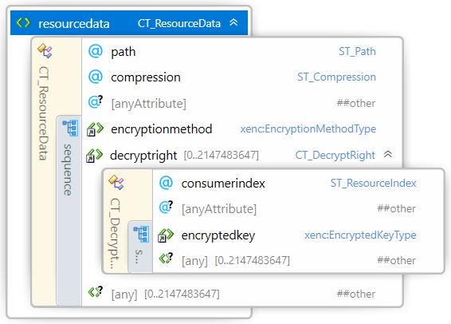

#
# 3MF Secure Content Extension

## Specification & Reference Guide


| **Version** | 0.7 |
| --- | --- |
| **Status** | Draft |

## Table of Contents

- [Preface](#preface)
  * [About this Specification](#about-this-specification)
  * [Document Conventions](#document-conventions)
  * [Language Notes](#language-notes)
  * [Software Conformance](#software-conformance)
- [Part I: 3MF Documents](#part-i-3mf-documents)
  * [Chapter 1. Introduction](#chapter-1-introduction)
    + [1.1 Encryption scheme](#11-encryption-scheme)
    + [1.2 Model Relationships](#12-model-relationships)
    + [1.3 Package Organization and OPC Compliance](#13-package-organization-and-opc-compliance)
    + [1.4 Secure Content Extension Additions Overview](#14-secure-content-extension-additions-overview)
  * [Chapter 2. Resources](#chapter-2-resources)
    + [2.1 Key Store](#21-key-store)
      - [2.1.1 Consumer](#211-consumer)
      - [2.1.2 Resource Data](#212-resource-data)
  * [Chapter 3. Secure Content Resources](#chapter-3-secure-content-resources)
    + [3.1 Object](#31-object)
    + [3.2 OPC Relation Files](#32-opc-relation-files)
- [Part II. Appendixes](#part-ii-appendixes)
  * [Appendix A. Glossary](#appendix-a-glossary)
  * [Appendix B. 3MF XSD Schema](#appendix-b-3mf-xsd-schema)
  * [Appendix C. Standard Namespace](#appendix-c-standard-namespace)
  * [Appendix D: Example file](#appendix-d-example-file)
- [References](#references)

# Preface

## About this Specification

This 3MF Secure Content Extension is an extension to the core 3MF specification. This document cannot stand alone and only applies as an addendum to the core 3MF specification. Usage of this and any other 3MF extensions follow an a la carte model, defined in the core 3MF specification.

Part I, “3MF Documents,” presents the details of the primarily XML-based 3MF Document format. This section describes the XML markup that defines the composition of 3D documents and the appearance of each model within the document.

Part II, “Appendixes,” contains additional technical details and schemas too extensive to include in the main body of the text as well as convenient reference information.

The information contained in this specification is subject to change. Every effort has been made to ensure its accuracy at the time of publication.

This extension MUST be used only with Core specification 1.2.

## Document Conventions

See the [3MF Core Specification conventions](https://github.com/3MFConsortium/spec_core/blob/master/3MF%20Core%20Specification.md#document-conventions).

In this extension specification, as an example, the prefix "po" maps to the xml-namespace "http://schemas.microsoft.com/3dmanufacturing/partoptimization/2019/04". See Appendix [C.3 Namespaces](#c3-namespaces).

## Language Notes

See the [3MF Core Specification language notes](https://github.com/3MFConsortium/spec_core/blob/master/3MF%20Core%20Specification.md#language-notes).

## Software Conformance

See the [3MF Core Specification software conformance](https://github.com/3MFConsortium/spec_core/blob/master/3MF%20Core%20Specification.md#software-conformance).

# Part I: 3MF Documents

# Chapter 1. Introduction

This document describes new non-object resources, as well as attributes for securely encrypting resources within a particular 3MF package. If not explicitly stated otherwise, each of these resources is OPTIONAL for producers, but MUST be supported by consumers that specify support for the Secure Content Extension of 3MF.

In order to allow for the use of 3MF in high security printing environments, several additions are needed to efficiently support confidentiality of specific content in the 3MF package, providing a 3MF producer with the capability to control which consumers have access to the confidential content.

A consumer not supporting the 3MF Secure Content Extension MUST be able to consume the 3MF with this extension. For this purpose,  3MF Secure Content Extension MUST contain alternative representation of confidential contents, e.g. low resolution information, bounding box, obfuscated model, etc.,  so the consumer could perform some basic tasks. For example, a consumer not supporting the current extension, should be able to render a low resolution preview or pack models in the build, without requiring access to secured content.

In order to avoid data loss while parsing, a 3MF package which uses referenced objects MUST enlist the Secure Content Extension as “required extension”, as defined in the core specification. However if the Secure Content Extension is not enlisted a required, any consumer which does not supprt the Secure Content Extension will be able to access the alternative non-confidential representation of confidential models.

## 1.1 Encryption scheme

The encryption model used is a 'two-level' Key Encryption Key - Data Encryption Key (KEK-DEK) model:

- Each confidential resource is encrypted using an efficient symmetric Data Encryption Method, with a randomly generated symmetric Data Encryption Key (DEK). There may be several resources in a 3MF package that requires confidentiality, so different DEKs MUST be provided for each one of them. In the current proposal, the only Data Encryption Method supported is AES256 GCM (Gaulois Counter Mode). In the future other Data Encryption Methods may be supported.

- The DEK for each one of the confidential resources is encrypted with one or several Key Encryption Keys (KEK), using Key Encryption Methods that ensure that only the intended consumers can decrypt and use the DEK. This means that the consumers must have an RSA2048 asymmetric private decryption key, and the corresponding public key must be made available to the producer to encrypt the DEK. In this proposal, the only Key Encryption Method supported is asymmetric RSA2048 OAEP. In the future, other Key Encryption Methods may be supported.

-	There could be several consumers for the same 3MF file and at the same time some consumers might have more than one pair of public and private keys, e.g. for different job types.  To provide simultaneous access to all authorized parties, the DEK for a confidential resource may be encrypted several times, one for each different potential consumer.

The KEK-DEK model provides efficiency because the (probably large) data in a confidential resource is encrypted/decrypted only once using an efficient symmetric encryption algorithm and KEK approach provides flexibility in controlling who can access the confidential data, by allowing encrypting the DEK with different KEKs.

## 1.2 Model Relationships

The primary emphasis of this extension is the possibility to encrypt store model data in files (or other resources) separate from the root model file. This structural approach enables three primary advantages for producers and consumers of 3MF packages with large numbers of individual models:

- The build directive in the root model file can be parsed by consumers without having to parse any encrypted file.
- Packing of a build by a job submitting application could be performed without the need to access to confidential encrypted content.
- Having a Key Store in a separate file allows to be shared between the root model and any encrypted model file. (HB: ?)

The root model part MAY have relationships to other model parts, whose object resources can be referenced by the parent model stream indirectly from the Key Store.

An encrypted model [includes?] by reference other resources through a Key Store, which is defined in the encrypted model and might be in an external file, either shared with the root model or on a separated one. [HB: ??]

As defined in the core 3MF spec, only the build section of the root model file contains valid build information. Other model streams SHOULD contain empty build sections. Every consumer MUST ignore the build section entries of all referenced child model files.

These limitations ensure there existence of ONLY a single level of "depth" to multi-file model relationships within a package and explicitly prevent complex or circular object references.


## 1.3 Package Organization and OPC Compliance

A new 3MF resource, the KeyStore, is defined to support content encryption. The KeyStore stores the encryption information for the different confidential resources in the package.
For each confidential resource, the KeyStore contains:

- Information on how the content is encrypted: the Data Encryption Method, and other information relevant to enable content decryption. For the only currently supported Data Encryption Method, the additional information is the initialization vector (IV) and tag required for decryption in the AES256 GCM Method. [HB: what about PADDING?]

- The DEK encrypted using one or several KEKs, with the corresponding information about the Key Encryption Method used. In the case of the currently supported Key Encryption Method: RSA2048 OAEP, there will be a different key entry for each one of the consumers authorized to access confidential content.

##### Figure 1–1. A typical 3MF Secure Content Document with multiple encrypted model streams


## 1.4 Secure Content Extension Additions Overview

There are additions to the 3MF core specification in the 3MF Secure Content Extension.  Each will be detailed by where it fits into the existing core 3MF constructs.  

##### Figure 1-2: Overview of 3MF Secure Content Extension XML structure


# Chapter 2. Resources

Element \<resources>


The \<keystore> element encapsulates encryption key data and references to the encrypted content.  The Key Stores are referenced from other resources in order to point to the encrypted content.  [HB: which resources need reference Key Store?]

## 2.1 Key Store

Element **\<keystore>**


| Name   | Type   | Use   | Default   | Annotation |
| --- | --- | --- | --- | --- |
| id | **ST\_ResourceID** | required |   | ResourceID of this key store resource. |
| path | **ST\_UriReference** |  |   | Path to the key store file. |
| @anyAttribute | | | | |

The \<keystore> element contains a set of \<consumer> elements and \<resourcedata> elements. Each \<consumer> element contains the information to identify a consumer key and each \<resourcedata> references the encrypted content and includes the information to be able to decrypt it, such as the encryption algorithm used and the data encryption key, encrypted with the key encryption key of each consumer.

**id** - The KeyStore resource id to be referenced by the attribute "keystoreid" in any resource to be encrypted.

**path** - The Key Store might contain an optional “path” attribute so a \<keystore> element MIGHT be stored in a separated file in the OPC package. When a \<keystore> element is stored in a separated file, the "path" attribute in the referencing \<keystore> in the root model references the file location inside the OPC package, and it MUST NOT contain any \<consumer> and \<resourcedata> elements. Then the referenced \<keystore> element in a separeted file MUST NOT contain any "path" attribute to avoid endless referencing.

### 2.1.1 Consumer

Element **\<consumer>**


| Name   | Type   | Use   | Default   | Annotation |
| --- | --- | --- | --- | --- |
| consumerid | **ST\_ResourceID** | required |   | ResourceID of this consumer resource. |
| @anyAttribute | | | | |

The \<consumer> element under a \<keystore> element contains the consumer specific information. When a \<keystore> element constains more than one consumer it means that there are more than a single recipient that could decrypt the content.

**consumerid** - The consumer ID attribute to be referenced from the \<decryptright> elements from a \<resourcedata> element to specify to which \<consumer> is intended the encrypted data encryption key.

A consumer MUST be identified by "consumerid", an attribute in \<consumer> element,  where ConsumerId is a human readable unique identifier (Alphanumeric). Each consumer is expected to have a unique id, which is known to both a producer and consumer

```xml
<consumer id=’HP#MOP44B#SG5693454’>
<consumer id=’HP#MOP44B#SG1632635’>
```

#### 2.1.1.1 Key Info

Element **\<keyinfo>**

It is possible that a consumer has different encrypttion key pairs. In this case, additional information about the specific key pair used as Key Encryption Key is needed. This information MUST be provided using a \<keyinfo> element as defined in the XML digital signature specification (https://www.w3.org/TR/xmldsig-core1/#sec-KeyInfo). The specific key to use MUST be identified by using the \<ds:KeyValue> element with the PEM formatted public key.

##### Figure 2–1. ds:KeyInfoType schema diagram


For the purposes of this specification, only the \<ds:KeyValue> element is supported for identifying the customer key. Consumers may disregard any pther element if present.

See the following example:

```xml
<consumer ConsumerId='HP#MOP44B#SG5693454'>
  <keyinfo>
    <ds:KeyValue><!--Consumer 0 public Key in PEM format--></ds:KeyValue>
  </keyinfo>
</consumer>
```

### 2.1.2 Resource Data

Element **\<resourcedata>**



| Name   | Type   | Use   | Default   | Annotation |
| --- | --- | --- | --- | --- |
| path | **ST\_Path** | required |  | Path to the encrypted resource file. |
| compression | **ST\_Compression** |  | none | Compression algorithm applied to content before is encrypted. |
| @anyAttribute | | | | |

The \<resourcedata> element under a \<keystore> element contains the resource specific encryption information for an encrypted resource and the file path to the encrypted content file.

**path** - Path to the encrypted file in the OPC package.

**compression** - Compression algorithm applied before encryption the content to obtain a significant compression ratio.

A producer MAY specify a compression “deflate” so the content is first compressed and then encrypted. When compression is "deflate", a consumer MUST first decrypt and then decompress the content.

Example of a complete \<resourcedata> element for an encrypted resource that can be accessed by two different consumers:
```xml
<resourcedata path=”path to encrypted file1 in package” compression="deflate">
  <encryptionmethod xenc:Algorithm="http://www.w3.org/2009/xmlenc11#aes256-gcm" />  
  <decryptright consumerindex="0">
    <encryptedkey>
      <xenc:EncryptionMethod xenc:Algorithm="http://www.w3.org/2001/04/xmlenc#rsa-oaep-mgf1p" \>
      <xenc:CipherData>
        <xenc:CipherValue><!-- base64(RSA2048_OAEP encrypted Data Encryption Key) --></xenc:CipherValue>
      </xenc:CipherData>
    </encryptedkey>
  </decryptright>
  <decryptright consumerindex="1">
    <encryptedkey>
      <xenc:EncryptionMethod xenc:Algorithm="http://www.w3.org/2001/04/xmlenc#rsa-oaep-mgf1p" \>
      <xenc:CipherData>
        <xenc:CipherValue><!-- base64(RSA2048_OAEP encrypted Data Encryption Key) --></xenc:CipherValue>
      </xenc:CipherData>
    </encryptedkey>
  </decryptright>
</resourcedata>
```

### 2.1.2.1 Encryption Method

Element **\<encryptionmethod>**

The \<encryptionmethod> element under the \<resourcedata> element contains the information on the encryption algorithm used to encrypt the reource data. It follows the syntax defined in as defined in the W3C XML Encryption specification (https://www.w3.org/TR/xmlenc-core1/#sec-EncryptionMethod).

##### Figure 2–2. xenc:EncryptionMethodType schema diagram


For this specification, the only algorithm supported for data encryption is AES256-GCM, identified with the URI http://www.w3.org/2009/xmlenc11#aes256-gcm:

> AES-GCM [SP800-38D] is an authenticated encryption mechanism. It is equivalent to doing these two operations in one step - AES encryption followed by HMAC signing.

> For the purposes of this specification, AES-GCM shall be used with a 96 bit Initialization Vector (IV) and a 128 bit Authentication Tag (T). The cipher text contains the IV first, followed by the encrypted octets and finally the Authentication tag. No padding should be used during encryption. During decryption the implementation should compare the authentication tag computed during decryption with the specified Authentication Tag, and fail if they don't match. For details on the implementation of AES-GCM, see [SP800-38D].

All other elements in the \<encryptionmethod> definition are ignored in this specification. Consumers may disregard these elements if present.

#### 2.1.2.2 Decrypt Right

Element **\<decryptright>**


| Name   | Type   | Use   | Default   | Annotation |
| --- | --- | --- | --- | --- |
| consumerindex | **ST\_ResourceIndex** | required | | Zero-based index to the \<customer> element containing the keys to decrypt the resource file |
| @anyAttribute | | | | |

The \<decryptright> element under a \<resourcedata> element contains the consumer specific information to decrypt the content file for a specific consumer. In particular, each \<decryptright> element contains the Date Encryption Key (DEK) encrypted with the consumer's public Key Encryption Key (KEK). 

**consumerindex** - Index to the \<consumer> element in the Key Store to select the Customer to which the decryption key is targeted.

#### 2.1.2.2.1 Encrypted key

Element **\<encryptedkey>**

The \<encryptedkey> element under the \<decryptright> element contains the public key to decrypt the content file, but encrypted for a specific consumer, granting its decryption rights.

##### Figure 2–3. xenc:EncryptedKeyType schema diagram


 For this specification, the only elements \<xenc:EncryptedKey> and \<xenc:CipherData> are supported.

 The information on the algorithm used to encrypt the Data Encryption Key (DEK) using the consumer's Key Encryption Key (KEK). It follows the syntax defined in https://www.w3.org/TR/xmlenc-core1/#sec-EncryptionMethod. For this specification, the only algorithm supported for key encryption is RSA OAEP with MFG1 with SHA1 mask generation, identified with the URI http://www.w3.org/2001/04/xmlenc#rsa-oaep-mgf1p.

From https://www.w3.org/TR/xmlenc-core1/#sec-RSA-OAEP:

> The RSAES-OAEP-ENCRYPT algorithm, as specified in RFC 3447 [PKCS1], has options that define the message digest function and mask generation function, as well as an optional PSourceAlgorithm parameter. Default values defined in RFC 3447 are SHA1 for the message digest and MGF1 with SHA1 for the mask generation function. Both the message digest and mask generation functions are used in the EME-OAEP-ENCODE operation as part of RSAES- OAEP-ENCRYPT. 

>  The http://www.w3.org/2001/04/xmlenc#rsa-oaep-mgf1p identifier defines the mask generation function as the fixed value of MGF1 with SHA1. In this case the optional xenc11:MGF element of the xenc:EncryptionMethod element MUST NOT be provided.

Since the digest method and mask generation function are fully defined in the algorithm URL, it is not necessary to add extra information (such as \<digestmethod> or \<mfg> elements) in the \<xenc:EncryptionMethod> element. Consumers may disregard those element if present.

The \<xenc:CipherData> element contains the encrypted key payload for a specific customer. It follows the syntax defined in http://www.w3.org/TR/xmlenc-core1/#sec-CipherData.

##### Figure 2–4. xenc:CipherDataType schema diagram


For the purposes of this specification only the \<xenc:CipherValue> element is supported. Consumers may disregard any other element if present.

# Chapter 3. Secure Content Resources

This chapter describes the resources that are protected by encryption.

## 3.1 Object

Element **\<object>**


| Name   | Type   | Use   | Default   | Annotation |
| --- | --- | --- | --- | --- |
| keystoreid | **ST\_ResourceID** |  |  | ResourceID of the store resource with the keys to the encrypted content. |
| resourcedataindex | **ST\_ResourceIndex** |  |   | Zero-based index to the resource data entry with the keys to the encrypted content. |
| meshresolution | **ST\_MeshResolution** |  | fullres  | Indicates the intended use the mesh model when the content is protected by Secure Content. |
| @anyAttribute | | | | |

The \<object> element in the 3MF core specification ([Chapter 4. Object Resources](https://github.com/3MFConsortium/spec_core/blob/master/3MF%20Core%20Specification.md#chapter-4-object-resources)) is extended with parts encryption to protect it's content.

**keystoreid** - Reference to the \<keystore> elements in \<resources> to select the Key Store containing the encryption information and keys.

**resourcedataindex** - Zero-based index to the \<resourcedata> element in the Key Store containing the access right by consumer and the path to the encrypted content.

**meshresolution** - An enumerated description of the mesh that is included in the \<object>. "meshresolution" gives consumers a hint about how the mesh data in the \<object> is intended to be used when DRM is present. Valid options are:
* "fullres": The included mesh data is "full resolution" and could be used to re-generate the slices contained in the 3MF package. The option "fullres" MUST NOT be used when the object is protected by DRM.
* "lowres": The included mesh is not sufficiently accurate to re-generate the model contained in the object.
* "obfuscated" when partial obfuscation techniques are applied, the model here encapsulates the original model, but had extra material added to cover some confidential surfaces/dimensions.

## 3.2 OPC Relation Files

All model files in the 3MF package MUST be referenced in .rels files in order to conform with OPC standards. The root model file MUST always be referenced in the root .rels file. Example root .rels file:
```xml
<?xml version="1.0" encoding="utf-8"?>
    <Relationships xmlns="http://schemas.openxmlformats.org/package/2006/relationships">
    <Relationship Type="http://schemas.microsoft.com/3dmanufacturing/2013/01/3dmodel" Target="/3D/build.model" Id="rel0" />
    <Relationship Type="http://schemas.openxmlformats.org/package/2006/relationships/metadata/thumbnail" Target="/Metadata/thumbnail.png" Id="rel4" />
</Relationships>
```

Any subsequente file after the root model file MUST not be referenced from the root .rels file. Referenced model files MUST be included in the .rels file from the referencing model file according to the part relationship defined in OPC. For example, assuming that the root model file in the /3D folder is named model.model, the non-root model file references MUST be in the /3D/\_rels/model.model.rels file:

```xml
<?xml version="1.0" encoding="utf-8"?>
    <Relationships xmlns="http://schemas.openxmlformats.org/package/2006/relationships">
    <Relationship Type="http://schemas.microsoft.com/3dmanufacturing/2019/04/keystore" Target="/3D/secure/keystore.xml" Id="rel1" />
    <Relationship Type="http://schemas.microsoft.com/3dmanufacturing/2019/04/encrypted3dmodel" Target="/3D/secure/object1.model.aes" Id="rel11" />
    <Relationship Type="http://schemas.microsoft.com/3dmanufacturing/2019/04/encrypted3dmodel" Target="/3D/secure/object2.model.aes" Id="rel12" />
    <Relationship Type="http://schemas.microsoft.com/3dmanufacturing/2019/04/encrypted3dmodel" Target="/3D/secure/object3.model.aes" Id="rel13" />
</Relationships>
```

# Part II. Appendixes

## Appendix A. Glossary

See [the 3MF Core Specification glossary](https://github.com/3MFConsortium/spec_core/blob/master/3MF%20Core%20Specification.md#appendix-a-glossary).

## Appendix B. 3MF XSD Schema

```xml
<?xml version="1.0" encoding="UTF-8"?>
<xs:schema xmlns="http://schemas.hp.com/3dmanufacturing/securecontent/2019/04" xmlns:xs="http://www.w3.org/2001/XMLSchema" xmlns:xenc="http://www.w3.org/2001/04/xmlenc#" xmlns:ds="http://www.w3.org/2000/09/xmldsig#" targetNamespace="http://schemas.hp.com/3dmanufacturing/securecontent/2019/04" elementFormDefault="unqualified" attributeFormDefault="unqualified" blockDefault="#all">
  <xs:import namespace="http://www.w3.org/XML/1998/namespace" schemaLocation="http://www.w3.org/2001/xml.xsd"/>
  <xs:import namespace="http://www.w3.org/2001/04/xmlenc#" schemaLocation="https://www.w3.org/TR/xmlenc-core1/xenc-schema.xsd"/>
  <xs:import namespace='http://www.w3.org/2000/09/xmldsig#' schemaLocation='http://www.w3.org/TR/2002/REC-xmldsig-core-20020212/xmldsig-core-schema.xsd'/>
  <xs:annotation>
    <xs:documentation><![CDATA[   Schema notes: 
 
  Items within this schema follow a simple naming convention of appending a prefix indicating the type of element for references: 
 
  Unprefixed: Element names 
  CT_: Complex types 
  ST_: Simple types 
   
  ]]></xs:documentation>
  </xs:annotation>
  <!-- Complex Types -->
  <xs:complexType name="CT_Resources">
    <xs:sequence>
      <xs:choice minOccurs="0" maxOccurs="2147483647">
        <xs:element ref="keystore" minOccurs="0" maxOccurs="2147483647"/>
        <xs:any namespace="##other" processContents="lax" minOccurs="0" maxOccurs="2147483647"/>
      </xs:choice>
    </xs:sequence>
    <xs:anyAttribute namespace="##other" processContents="lax"/>
  </xs:complexType>
  <xs:complexType name="CT_Object">
    <xs:attribute name="keystoreid" type="ST_ResourceID"/>
    <xs:attribute name="resourcedataindex" type="ST_ResourceIndex"/>
    <xs:attribute name="meshresolution" type="ST_MeshResolution" default="fullres"/>
    <xs:anyAttribute namespace="##other" processContents="lax"/>
  </xs:complexType>
  <xs:complexType name="CT_KeyStore">
    <xs:sequence>
      <xs:element ref="consumer" minOccurs="0" maxOccurs="2147483647"/>
      <xs:element ref="resourcedata" minOccurs="0" maxOccurs="2147483647"/>
      <xs:any namespace="##other" processContents="lax" minOccurs="0" maxOccurs="2147483647"/>
    </xs:sequence>
    <xs:attribute name="id" type="ST_ResourceID" use="required"/>
    <xs:attribute name="path" type="ST_Path"/>
    <xs:anyAttribute namespace="##other" processContents="lax"/>
  </xs:complexType>
  <xs:complexType name="CT_Consumer">
    <xs:sequence>
      <xs:element ref="keyinfo" minOccurs="0"/>
       <xs:any namespace="##other" processContents="lax" minOccurs="0" maxOccurs="2147483647"/>
    </xs:sequence>
    <xs:attribute name="consumerid" type="xs:string"/>
    <xs:anyAttribute namespace="##other" processContents="lax"/>
  </xs:complexType>
  <xs:complexType name="CT_ResourceData">
    <xs:sequence>
      <xs:element ref="encryptionmethod"/>
      <xs:element ref="decryptright" minOccurs="0" maxOccurs="2147483647"/>
      <xs:any namespace="##other" processContents="lax" minOccurs="0" maxOccurs="2147483647"/>
    </xs:sequence>
    <xs:attribute name="path" type="ST_Path" use="required"/>
    <xs:attribute name="compression" type="ST_Compression" default="none"/>
    <xs:anyAttribute namespace="##other" processContents="lax"/>
  </xs:complexType>
  <xs:complexType name="CT_DecryptRight">
    <xs:sequence>
      <xs:element ref="encryptedkey"/>
      <xs:any namespace="##other" processContents="lax" minOccurs="0" maxOccurs="2147483647"/>
    </xs:sequence>
    <xs:attribute name="consumerindex" type="ST_ResourceIndex" use="required"/>
    <xs:anyAttribute namespace="##other" processContents="lax"/>
  </xs:complexType>
   <xs:simpleType name="ST_Path">
    <xs:restriction base="xs:string"/>
  </xs:simpleType>
  <xs:simpleType name="ST_ResourceID">
    <xs:restriction base="xs:positiveInteger">
      <xs:maxExclusive value="2147483648"/>
    </xs:restriction>
  </xs:simpleType>
  <xs:simpleType name="ST_ResourceIndex">
    <xs:restriction base="xs:nonNegativeInteger">
      <xs:maxExclusive value="2147483648"/>
    </xs:restriction>
  </xs:simpleType>
  <xs:simpleType name="ST_MeshResolution">
    <xs:restriction base="xs:string">
      <xs:enumeration value="fullres"/>
      <xs:enumeration value="lowres"/>
      <xs:enumeration value="obfuscated"/>
    </xs:restriction>
  </xs:simpleType>
  <xs:simpleType name="ST_Compression">
    <xs:restriction base="xs:string">
      <xs:enumeration value="none"/>
      <xs:enumeration value="deflate"/>
    </xs:restriction>
  </xs:simpleType>
  <!-- Elements -->
  <xs:element name="resources" type="CT_Resources"/>
  <xs:element name="object" type="CT_Object"/>
  <xs:element name="keystore" type="CT_KeyStore"/>
  <xs:element name="consumer" type="CT_Consumer"/>
  <xs:element name="resourcedata" type="CT_ResourceData"/>
  <xs:element name="decryptright" type="CT_DecryptRight"/>
  <xs:element name="keyinfo" type="ds:KeyInfoType"/>
  <xs:element name="encryptionmethod" type="xenc:EncryptionMethodType"/>
  <xs:element name="encryptedkey" type="xenc:EncryptedKeyType"/>
</xs:schema>
```

# Appendix C. Standard Namespace

| | |
| --- | --- |
|Secure Content | [http://schemas.microsoft.com/3dmanufacturing/securecontent/2019/04](http://schemas.microsoft.com/3dmanufacturing/securecontent/2019/04) |

# Appendix D: Example file

## 3D model
```xml
<!-- TODO Example -->
```

# References

**W3C XML Encryption Syntax and Processing Version 1.1**

Specification for encrypting data and representing the result in XML. https://www.w3.org/TR/xmlenc-core1/.

**W3C XML Signature Syntax and Processing Version 1.1**

Specification for XML digital signature processing rules and syntax. http://www.w3.org/TR/xmldsig-core1/.

**BNF of Generic URI Syntax**

"BNF of Generic URI Syntax." World Wide Web Consortium. http://www.w3.org/Addressing/URL/5\_URI\_BNF.html

**Open Packaging Conventions**

Ecma International. "Office Open XML Part 2: Open Packaging Conventions." 2006. http://www.ecma-international.org

**Unicode**

The Unicode Consortium. The Unicode Standard, Version 4.0.0, defined by: _The Unicode Standard, Version 4.0_. Boston, MA: Addison-Wesley, 2003.

**XML**

Bray, Tim, Eve Maler, Jean Paoli, C. M. Sperlberg-McQueen, and François Yergeau (editors). "Extensible Markup Language (XML) 1.0 (Fourth Edition)." World Wide Web Consortium. 2006. http://www.w3.org/TR/2006/REC-xml-20060816/

**XML C14N**

Boyer, John. "Canonical XML Version 1.0." World Wide Web Consortium. 2001. http://www.w3.org/TR/xml-c14n.

**XML Namespaces**

Bray, Tim, Dave Hollander, Andrew Layman, and Richard Tobin (editors). "Namespaces in XML 1.0 (Second Edition)." World Wide Web Consortium. 2006. http://www.w3.org/TR/2006/REC-xml-names-20060816/

**XML Schema**

Beech, David, Murray Maloney, Noah Mendelsohn, and Henry S. Thompson (editors). "XML Schema Part 1: Structures," Second Edition. World Wide Web Consortium. 2004. http://www.w3.org/TR/2004/REC-xmlschema-1-20041028/

Biron, Paul V. and Ashok Malhotra (editors). "XML Schema Part 2: Datatypes," Second Edition. World Wide Web Consortium. 2004. http://www.w3.org/TR/2004/REC-xmlschema-2-20041028/
