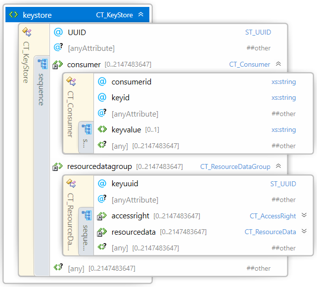
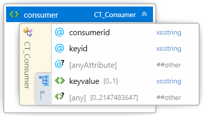

#
# 3MF Secure Content Extension

## Specification & Reference Guide


| **Version** | 0.8 |
| --- | --- |
| **Status** | Draft |

## Table of Contents

- [Preface](#preface)
  * [About this Specification](#about-this-specification)
  * [Document Conventions](#document-conventions)
  * [Language Notes](#language-notes)
  * [Software Conformance](#software-conformance)
- [Part I: 3MF Documents](#part-i-3mf-documents)
  * [Chapter 1. Introduction](#chapter-1-introduction)
    + [1.1 Encryption scheme](#11-encryption-scheme)
    + [1.2 Model Relationships](#12-model-relationships)
    + [1.3 Package Organization and OPC Compliance](#13-package-organization-and-opc-compliance)
  * [Chapter 2. Key Store](#2-key-store)
      - [2.1 Consumer](#21-consumer)
      - [2.2 Resource Data](#22-resource-data)
  * [Chapter 3. OPC Relation and Content Types](#chapter-3-opc-relation-and-content-types)
    + [3.1 Content Types](#31-content-types)
    + [3.2 Relation Files](#32-relation-files)
- [Part II. Appendixes](#part-ii-appendixes)
  * [Appendix A. Glossary](#appendix-a-glossary)
  * [Appendix B. 3MF XSD Schema](#appendix-b-3mf-xsd-schema)
  * [Appendix C. Standard Content Types and Relationships](#appendix-c-standard-content-types-and-relationships)
    + [C.1 Content Types](#c1-content-types)
    + [C.2 Relationships](#c2-relationships)
  * [Appendix D: Example file](#appendix-d-example-file)
- [References](#references)

# Preface

## About this Specification

This 3MF Secure Content Extension is an extension to the core 3MF specification. This document cannot stand alone and only applies as an addendum to the core 3MF specification. Usage of this and any other 3MF extensions follow an a la carte model, defined in the core 3MF specification.

Part I, “3MF Documents,” presents the details of the primarily XML-based 3MF Document format. This section describes the XML markup that defines the composition of 3D documents and the appearance of each model within the document.

Part II, “Appendixes,” contains additional technical details and schemas too extensive to include in the main body of the text as well as convenient reference information.

The information contained in this specification is subject to change. Every effort has been made to ensure its accuracy at the time of publication.

This extension MUST be used only with Core specification 1.x.

## Document Conventions

See [the 3MF Core Specification conventions](https://github.com/3MFConsortium/spec_core/blob/master/3MF%20Core%20Specification.md#document-conventions).

## Language Notes

See [the 3MF Core Specification language notes](https://github.com/3MFConsortium/spec_core/blob/master/3MF%20Core%20Specification.md#language-notes).

## Software Conformance

See [the 3MF Core Specification software conformance](https://github.com/3MFConsortium/spec_core/blob/master/3MF%20Core%20Specification.md#software-conformance).

# Part I: 3MF Documents

# Chapter 1. Introduction

This document describes a new Open Packaging Conventions (OPC) root part for securely protecting resources within a particular 3MF package. If not explicitly stated otherwise, each of these resources is OPTIONAL for producers, but MUST be supported by consumers that specify support for the 3MF Secure Content Extension.

This extension describes the encryption mechanism to protect the the 3MF content files (OPC parts), and it should be used in coordination with other 3MF extensions that refer to content stored in different OPC parts: models, textures, etc.

In order to allow for the use of 3MF in highly secure printing environments, several additions are needed to efficiently support confidentiality of specific content in the 3MF package, providing a 3MF producer with the capability to control which consumers have access to the confidential content.

A consumer not supporting the 3MF Secure Content Extension MAY be able to consume the 3MF with this extension. For this purpose, the 3MF Secure Content Extension MAY contain alternative representation of confidential contents (See [the 3MF Production Extension](https://github.com/3MFConsortium/spec_production/blob/1.2-update/3MF%20Production%20Extension.md), e.g. low resolution information, bounding box, obfuscated model, etc., so the consumer could perform some basic tasks. For example, a consumer not supporting the current extension, should be able to render a low resolution preview or pack models in the build, without requiring access to secured content.

In order to avoid data loss while parsing, a 3MF package which uses referenced objects MUST enlist the Secure Content Extension as “required extension”, as defined in the core specification. However if the Secure Content Extension is not enlisted as required, any consumer which does not support the Secure Content Extension will be able to access the alternative non-confidential representation of confidential models.

A consumer that is authorized to un-protect content by reversing the above steps MUST NOT re-save the content or enable the user to save the content in an unprotected fashion (regardless of file format) without the approval (written or programmatic) of the protection authority (which might or might not be the producer).

## 1.1 Encryption scheme

The encryption model used is a 'two-level' Key Encryption Key - Data Encryption Key (KEK-DEK) model:

- Each confidential resource is encrypted using an efficient symmetric Data Encryption Method, with a randomly generated symmetric Data Encryption Key (DEK). There may be several resources in a 3MF package that requires confidentiality, so different DEKs MUST be provided for each one of them. In the current proposal, the only Data Encryption Method supported is AES256 GCM (Gaulois Counter Mode). In the future other Data Encryption Methods may be supported.

- The DEK for each one of the confidential resources is encrypted with one or several Key Encryption Keys (KEK), using Key Encryption Methods that ensure that only the intended consumers can decrypt and use the DEK. This means that the consumers must have an RSA2048 asymmetric private decryption key, and the corresponding public key must be made available to the producer to encrypt the DEK. In this proposal, the only Key Encryption Method supported is asymmetric RSA2048 OAEP. In the future, other Key Encryption Methods may be supported.

-	There could be several consumers for the same 3MF file and at the same time some consumers might have more than one pair of public and private keys, e.g. for different job types.  To provide simultaneous access to all authorized parties, the DEK for a confidential resource may be encrypted several times, one for each different potential consumer.

The KEK-DEK model provides efficiency because the (probably large) data in a confidential resource is encrypted/decrypted only once using an efficient symmetric encryption algorithm and KEK approach provides flexibility in controlling who can access the confidential data, by allowing encrypting the DEK with different KEKs.

## 1.2 Parts Relationships

The primary emphasis of this extension is the possibility to protect OPC parts separated from the root model file. This structural approach enables two primary advantages for producers and consumers of 3MF packages with large numbers of individual models:

- The build directive in the root model file can be parsed by consumers without having to parse any encrypted file.
- Key Store in a separate file to be able to link to any content file, except the root model part.

When used in conjunction with the 3MF Production extension version 1.2 or above, the root model part MAY have relationships to other model parts whose resources can be referenced by the parent model stream by their file path. When any of those file paths is found in the keystore, it is identified as an encrypted OPC part.

Other content files defined in other 3MF extensions might be also encrypted, when identified by their file paths in the keystore. For example, color textures as defined in the 3MF materials and properties extension, etc.

Only non-root OPC parts MAY be encrypted. Root OPC parts and parts relationships MUST not be encrypted to be compliant with OPC.

## 1.3 Package Organization and OPC Compliance

A new 3MF resource, the KeyStore, is defined to support content encryption. The KeyStore stores the encryption information for the different confidential resources in the package.

For each confidential resource, the KeyStore contains:

- Information on how the content is encrypted: the Data Encryption Method, and other information relevant to enable content decryption. For the only currently supported Data Encryption Method, the additional information is the initialization vector (IV) and tag required for decryption in the AES256 GCM Method.

- One DEK encrypted using a KEKs, with the corresponding information about the Key Encryption Method used, for each one of the consumers authorized to access confidential content. Currently it is supported only one Key Encryption Method: RSA2048 OAEP.

##### Figure 1–1. A typical 3MF Secure Content Document with multiple encrypted model streams


# Chapter 2. Key Store

Element **\<keystore>**



| Name   | Type   | Use   | Default   | Annotation |
| --- | --- | --- | --- | --- |
| uuid | **ST\_UUID** | required |   | A universally unique ID that allows the Key Store to be identified. |
| @anyAttribute | | | | |

The Key Store part consists of a \<keystore> element that encapsulates encryption key data and references to the encrypted content. 

The \<keystore> element contains a set of \<consumer> elements and \<resourcedata> elements. Each \<consumer> element contains the information to identify a consumer key and each \<resourcedata> references the encrypted content and includes the information to be able to decrypt it, such as the encryption algorithm used and the data encryption key, encrypted with the key encryption key of each consumer.

**uuid** - The KeyStore universal unique ID that allows the Key Store to be idetified over time and across physical and across applications and printers.

When an editor modifies the Key Store, it MUST produce a new uuid to univocally identify the new keystore content.

>**Note:** "Unique identifier" MUST be any of the four UUID variants described in IETF RFC 4122, which includes Microsoft GUIDs as well as time-based UUIDs.

## 2.1 Consumer

Element **\<consumer>**



| Name   | Type   | Use   | Default   | Annotation |
| --- | --- | --- | --- | --- |
| consumerid | **ST\_ResourceID** | required |   | ResourceID of this consumer resource. |
| @anyAttribute | | | | |

The \<consumer> element under a \<keystore> element contains the consumer specific information. When a \<keystore> element constains more than one consumer it means that there are more than a single recipient that could decrypt the content.

**consumerid** - The consumer ID attribute to be referenced from the \<decryptright> elements from a \<resourcedata> element to specify to which \<consumer> is intended the encrypted data encryption key.

A consumer MUST be identified by "consumerid", an attribute in \<consumer> element,  where ConsumerId is a human readable unique identifier (Alphanumeric). Each consumer is expected to have a unique id, which is known to both a producer and consumer

```xml
<consumer id=’HP#MOP44B#SG5693454’>
<consumer id=’HP#MOP44B#SG1632635’>
```

### 2.1.1 Key Info

Element **\<keyinfo>**

It is possible that a consumer has different encrypttion key pairs. In this case, additional information about the specific key pair used as Key Encryption Key is needed. This information MUST be provided using a \<keyinfo> element as defined in the XML digital signature specification (https://www.w3.org/TR/xmldsig-core1/#sec-KeyInfo). The specific key to use MUST be identified by using the \<ds:KeyValue> element with the PEM formatted public key.

##### Figure 2–1. ds:KeyInfoType schema diagram


For the purposes of this specification, only the \<ds:KeyValue> element is supported for identifying the customer key. Consumers may disregard any pther element if present.

See the following example:

```xml
<consumer ConsumerId='HP#MOP44B#SG5693454'>
  <keyinfo>
    <ds:KeyValue><!--Consumer 0 public Key in PEM format--></ds:KeyValue>
  </keyinfo>
</consumer>
```

## 2.2 Resource Data

Element **\<resourcedata>**


| Name   | Type   | Use   | Default   | Annotation |
| --- | --- | --- | --- | --- |
| path | **ST\_Path** | required |  | Path to the encrypted resource file. |
| compression | **ST\_Compression** |  | none | Compression algorithm applied to content before is encrypted. |
| @anyAttribute | | | | |

The \<resourcedata> element under a \<keystore> element contains the resource specific encryption information for an encrypted resource and the file path to the encrypted content file.

**path** - Path to the encrypted file in the OPC package. The path MUST be treated as a hash map to identify encrypted files referenced from any XML model file by their path attribute defined in 3MF extensions. A given file path must be unique; it MUST NOT show up in more than one \<resourcedata> element.

When a model resource path is found in a \<resourcedata> element, the content of that file MUST be encrypted.

**compression** - Compression algorithm applied before encryption the content to obtain a significant compression ratio.

A producer MAY specify a compression “deflate” so the content is first compressed and then encrypted. When compression is "deflate", a consumer MUST first decrypt and then decompress the content.

Example of a complete \<resourcedata> element for an encrypted resource that can be accessed by two different consumers:
```xml
<resourcedata path=”path to encrypted file1 in package” compression="deflate">
  <encryptionmethod xenc:Algorithm="http://www.w3.org/2009/xmlenc11#aes256-gcm" />  
  <decryptright consumerindex="0">
    <encryptedkey>
      <xenc:EncryptionMethod xenc:Algorithm="http://www.w3.org/2001/04/xmlenc#rsa-oaep-mgf1p" \>
      <xenc:CipherData>
        <xenc:CipherValue><!-- base64(RSA2048_OAEP encrypted Data Encryption Key) --></xenc:CipherValue>
      </xenc:CipherData>
    </encryptedkey>
  </decryptright>
  <decryptright consumerindex="1">
    <encryptedkey>
      <xenc:EncryptionMethod xenc:Algorithm="http://www.w3.org/2001/04/xmlenc#rsa-oaep-mgf1p" \>
      <xenc:CipherData>
        <xenc:CipherValue><!-- base64(RSA2048_OAEP encrypted Data Encryption Key) --></xenc:CipherValue>
      </xenc:CipherData>
    </encryptedkey>
  </decryptright>
</resourcedata>
```

### 2.2.1 Encryption Method

Element **\<encryptionmethod>**

The \<encryptionmethod> element under the \<resourcedata> element contains the information on the encryption algorithm used to encrypt the reource data. It follows the syntax defined in as defined in the W3C XML Encryption specification (https://www.w3.org/TR/xmlenc-core1/#sec-EncryptionMethod).

##### Figure 2–2. xenc:EncryptionMethodType schema diagram


For this specification, the only algorithm supported for data encryption is AES256-GCM, identified with the URI http://www.w3.org/2009/xmlenc11#aes256-gcm:

> AES-GCM [SP800-38D] is an authenticated encryption mechanism. It is equivalent to doing these two operations in one step - AES encryption followed by HMAC signing.

> For the purposes of this specification, A-ES-GCM shall be used with a 96 bit Initialization Vector (IV) and a 128 bit Authentication Tag (T). The cipher text contains the IV first, followed by the encrypted octets and finally the Authentication tag. No padding should be used during encryption. During decryption the implementation should compare the authentication tag computed during decryption with the specified Authentication Tag, and fail if they don't match. For details on the implementation of AES-GCM, see [SP800-38D].

All other elements in the \<encryptionmethod> definition are ignored in this specification. Consumers may disregard these elements if present.

### 2.2.2 Decrypt Right

Element **\<decryptright>**


| Name   | Type   | Use   | Default   | Annotation |
| --- | --- | --- | --- | --- |
| consumerindex | **ST\_ResourceIndex** | required | | Zero-based index to the \<customer> element containing the keys to decrypt the resource file |
| @anyAttribute | | | | |

The \<decryptright> element under a \<resourcedata> element contains the consumer specific information to decrypt the content file for a specific consumer. In particular, each \<decryptright> element contains the Date Encryption Key (DEK) encrypted with the consumer's public Key Encryption Key (KEK). 

**consumerindex** - Index to the \<consumer> element in the Key Store to select the Customer to which the decryption key is targeted.

#### 2.2.2.1 Encrypted key

Element **\<encryptedkey>**

The \<encryptedkey> element under the \<decryptright> element contains the public key to decrypt the content file, but encrypted for a specific consumer, granting its decryption rights.

##### Figure 2–3. xenc:EncryptedKeyType schema diagram


 For this specification, the only elements \<xenc:EncryptedKey> and \<xenc:CipherData> are supported.

 The information on the algorithm used to encrypt the Data Encryption Key (DEK) using the consumer's Key Encryption Key (KEK). It follows the syntax defined in https://www.w3.org/TR/xmlenc-core1/#sec-EncryptionMethod. For this specification, the only algorithm supported for key encryption is RSA OAEP with MFG1 with SHA1 mask generation, identified with the URI http://www.w3.org/2001/04/xmlenc#rsa-oaep-mgf1p.

From https://www.w3.org/TR/xmlenc-core1/#sec-RSA-OAEP:

> The RSAES-OAEP-ENCRYPT algorithm, as specified in RFC 3447 [PKCS1], has options that define the message digest function and mask generation function, as well as an optional PSourceAlgorithm parameter. Default values defined in RFC 3447 are SHA1 for the message digest and MGF1 with SHA1 for the mask generation function. Both the message digest and mask generation functions are used in the EME-OAEP-ENCODE operation as part of RSAES- OAEP-ENCRYPT. 

>  The http://www.w3.org/2001/04/xmlenc#rsa-oaep-mgf1p identifier defines the mask generation function as the fixed value of MGF1 with SHA1. In this case the optional xenc11:MGF element of the xenc:EncryptionMethod element MUST NOT be provided.

Since the digest method and mask generation function are fully defined in the algorithm URL, it is not necessary to add extra information (such as \<digestmethod> or \<mfg> elements) in the \<xenc:EncryptionMethod> element. Consumers may disregard those element if present.

The \<xenc:CipherData> element contains the encrypted key payload for a specific customer. It follows the syntax defined in http://www.w3.org/TR/xmlenc-core1/#sec-CipherData.

##### Figure 2–4. xenc:CipherDataType schema diagram


For the purposes of this specification only the \<xenc:CipherValue> element is supported. Consumers may disregard any other element if present.

# Chapter 3. OPC Relation and Content Types

The Key Store in a 3MF document is identified by a new content type and a new relationship.

## 3.1 Content Types

The Key Store MUST be defined in the OPC ContentTypes part by overriding the default XML definition.

```xml
<?xml version="1.0" encoding="UTF-8" standalone="no"?>
<Types xmlns="http://schemas.openxmlformats.org/package/2006/content-types">
    <Default ContentType="application/vnd.openxmlformats-package.relationships+xml" Extension="rels"/>
    <Override ContentType="application/vnd.ms-package.3dmanufacturing-3dmodel+xml" PartName="/3D/3Dmodel.moodel"/>
    <Override ContentType="application/vnd.ms-package.3dmanufacturing-keystore+xml" PartName="/Secure/keystore.xml"/>
    <Default ContentType="image/png" Extension="png"/>
</Types>
```

## 3.2 Relation Files

The Key Store file MUST always be referenced in the root .rels file in order to conform with OPC standards.

The Key Store file SHOULD be specified as a MustPreserve relationship type, in order that editors that do not support this extension are still instructed to save it back when modifying the 3MF.

Example root .rels file, where the keystore part is referenced twice: one the KeyStore relationship type and a second for the MustPreserve relationship type.

```xml
<?xml version="1.0" encoding="utf-8"?>
    <Relationships xmlns="http://schemas.openxmlformats.org/package/2006/relationships">
    <Relationship Type="http://schemas.microsoft.com/3dmanufacturing/2013/01/3dmodel" Target="/3D/build.model" Id="rel0" />
    <Relationship Type="http://schemas.openxmlformats.org/package/2006/relationships/metadata/thumbnail" Target="/Metadata/thumbnail.png" Id="rel4" />
   <Relationship Type="http://schemas.microsoft.com/3dmanufacturing/2019/04/keystore" Target="/Secure/keystore.xml" Id="rel10" />
   <Relationship Type="http://schemas.openxmlformats.org/package/2006/relationships/mustpreserve" Target="/Secure/keystore.xml" Id="rel11" />
</Relationships>
```

# Part II. Appendixes

## Appendix A. Glossary

See [the 3MF Core Specification glossary](https://github.com/3MFConsortium/spec_core/blob/master/3MF%20Core%20Specification.md#appendix-a-glossary).

## Appendix B. 3MF XSD Schema

```xml
<?xml version="1.0" encoding="UTF-8"?>
<xs:schema xmlns="http://schemas.hp.com/3dmanufacturing/securecontent/2019/04" xmlns:xs="http://www.w3.org/2001/XMLSchema" xmlns:xenc="http://www.w3.org/2001/04/xmlenc#" xmlns:ds="http://www.w3.org/2000/09/xmldsig#" targetNamespace="http://schemas.hp.com/3dmanufacturing/securecontent/2019/04" elementFormDefault="unqualified" attributeFormDefault="unqualified" blockDefault="#all">
  <xs:import namespace="http://www.w3.org/XML/1998/namespace" schemaLocation="http://www.w3.org/2001/xml.xsd"/>
  <xs:import namespace="http://www.w3.org/2001/04/xmlenc#" schemaLocation="https://www.w3.org/TR/xmlenc-core1/xenc-schema.xsd"/>
  <xs:import namespace='http://www.w3.org/2000/09/xmldsig#' schemaLocation='http://www.w3.org/TR/2002/REC-xmldsig-core-20020212/xmldsig-core-schema.xsd'/>
  <xs:annotation>
    <xs:documentation><![CDATA[   Schema notes: 
 
  Items within this schema follow a simple naming convention of appending a prefix indicating the type of element for references: 
 
  Unprefixed: Element names 
  CT_: Complex types 
  ST_: Simple types 
   
  ]]></xs:documentation>
  </xs:annotation>
  <!-- Complex Types -->
  <xs:complexType name="CT_KeyStore">
    <xs:sequence>
      <xs:element ref="consumer" minOccurs="0" maxOccurs="2147483647"/>
      <xs:element ref="resourcedata" minOccurs="0" maxOccurs="2147483647"/>
      <xs:any namespace="##other" processContents="lax" minOccurs="0" maxOccurs="2147483647"/>
    </xs:sequence>
    <xs:attribute name="UUID" type="ST_UUID" use="required"/>
    <xs:anyAttribute namespace="##other" processContents="lax"/>
  </xs:complexType>
  <xs:complexType name="CT_Consumer">
    <xs:sequence>
      <xs:element ref="keyinfo" minOccurs="0"/>
       <xs:any namespace="##other" processContents="lax" minOccurs="0" maxOccurs="2147483647"/>
    </xs:sequence>
    <xs:attribute name="consumerid" type="xs:string"/>
    <xs:anyAttribute namespace="##other" processContents="lax"/>
  </xs:complexType>
  <xs:complexType name="CT_ResourceData">
    <xs:sequence>
      <xs:element ref="encryptionmethod"/>
      <xs:element ref="decryptright" minOccurs="0" maxOccurs="2147483647"/>
      <xs:any namespace="##other" processContents="lax" minOccurs="0" maxOccurs="2147483647"/>
    </xs:sequence>
    <xs:attribute name="path" type="ST_Path" use="required"/>
    <xs:attribute name="compression" type="ST_Compression" default="none"/>
    <xs:anyAttribute namespace="##other" processContents="lax"/>
  </xs:complexType>
  <xs:complexType name="CT_DecryptRight">
    <xs:sequence>
      <xs:element ref="encryptedkey"/>
      <xs:any namespace="##other" processContents="lax" minOccurs="0" maxOccurs="2147483647"/>
    </xs:sequence>
    <xs:attribute name="consumerindex" type="ST_ResourceIndex" use="required"/>
    <xs:anyAttribute namespace="##other" processContents="lax"/>
  </xs:complexType>
   <xs:simpleType name="ST_Path">
    <xs:restriction base="xs:string"/>
  </xs:simpleType>
  <xs:simpleType name="ST_ResourceID">
    <xs:restriction base="xs:positiveInteger">
      <xs:maxExclusive value="2147483648"/>
    </xs:restriction>
  </xs:simpleType>
  <xs:simpleType name="ST_ResourceIndex">
    <xs:restriction base="xs:nonNegativeInteger">
      <xs:maxExclusive value="2147483648"/>
    </xs:restriction>
  </xs:simpleType>
  <xs:simpleType name="ST_Compression">
    <xs:restriction base="xs:string">
      <xs:enumeration value="none"/>
      <xs:enumeration value="deflate"/>
    </xs:restriction>
  </xs:simpleType>
  <xs:simpleType name="ST_UUID">
    <xs:restriction base="xs:string">
      <xs:pattern value="[a-f0-9]{8}-[a-f0-9]{4}-[a-f0-9]{4}-[a-f0-9]{4}-[a-f0-9]{12}"/>
    </xs:restriction>
  </xs:simpleType>
  <!-- Elements -->
  <xs:element name="keystore" type="CT_KeyStore"/>
  <xs:element name="consumer" type="CT_Consumer"/>
  <xs:element name="resourcedata" type="CT_ResourceData"/>
  <xs:element name="decryptright" type="CT_DecryptRight"/>
  <xs:element name="keyinfo" type="ds:KeyInfoType"/>
  <xs:element name="encryptionmethod" type="xenc:EncryptionMethodType"/>
  <xs:element name="encryptedkey" type="xenc:EncryptedKeyType"/>
</xs:schema>
```

# Appendix C. Standard Content Types and Relationships

## C.1 Content Types

Secure Content application/vnd.ms-package.3dmanufacturing-keystore+xml

## C.2 Relationships

Secure Content [http://schemas.microsoft.com/3dmanufacturing/2019/04/keystore](http://schemas.microsoft.com/3dmanufacturing/2019/04/keystore)

# Appendix D: Example file

## 3D model
```xml
<!-- TODO Example -->
```

# References

**W3C XML Encryption Syntax and Processing Version 1.1**

Specification for encrypting data and representing the result in XML. https://www.w3.org/TR/xmlenc-core1/.

**W3C XML Signature Syntax and Processing Version 1.1**

Specification for XML digital signature processing rules and syntax. http://www.w3.org/TR/xmldsig-core1/.

For additional references See [the 3MF Core Specification references](https://github.com/3MFConsortium/spec_core/blob/1.2.3/3MF%20Core%20Specification.md#references).

Copyright 3MF Consortium 2019.